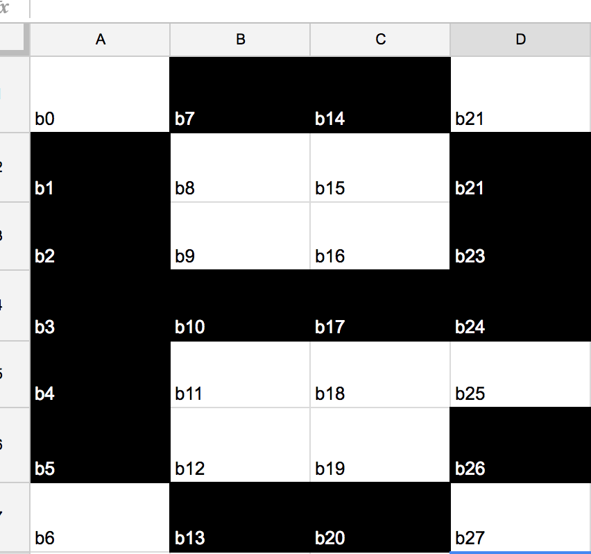

# InitAlphabet

## 아두이노에 들어갈 알파벳 배열을 만드는 프로그램입니다.

### 만드는 법 

1.   엑셀 파일을 열고 다음과 같이 알파벳 모양을 만듭니다.
       

2. 엑셀 파일의 각 셀을 다음과 같이 넘버링 하고
       

3. 다음과 같이 함수를 만듭니다.   검정 노트는 1,흰 노트는 0으로 표현합니다.  
   ```
   // a
   void seta() {
       alphabet[0].b0 = 0;
       alphabet[0].b1 = 1;
       alphabet[0].b2 = 1;
       alphabet[0].b3 = 1;
       alphabet[0].b4 = 1;
       alphabet[0].b5 = 1;
       alphabet[0].b6 = 0;

       alphabet[0].b7 = 1;
       alphabet[0].b8 = 0;
       alphabet[0].b9 = 0;
       alphabet[0].b10 = 0;
       alphabet[0].b11 = 0;
       alphabet[0].b12 = 0;
       alphabet[0].b13 = 1;

       alphabet[0].b14 = 0;
       alphabet[0].b15 = 1;
       alphabet[0].b16 = 0;
       alphabet[0].b17 = 0;
       alphabet[0].b18 = 0;
       alphabet[0].b19 = 1;
       alphabet[0].b20 = 0;

       alphabet[0].b21 = 1;
       alphabet[0].b22 = 1;
       alphabet[0].b23 = 1;
       alphabet[0].b24 = 1;
       alphabet[0].b25 = 1;
       alphabet[0].b26 = 1;
       alphabet[0].b27 = 1;
   }
   ```

   ​

4. 그리고 테스트해봅니다.

   ```
   printAlphabet(alphabet[0]);
   ```

5. 정상적으로 뜬다면 다음 알파벳으로 넘어갑니다.

   ​

   ​

###  개발환경 구축 방법 

1. `git` 이 설치되어 있지 않으신 분은 `git` 을 [설치](https://git-scm.com/)하세요
2. `git bash ` 또는 `terminal` 에 `git clone https://github.com/CoffeeBay/InitAlphabet.git`  명령어를 치세요
3. `cd InitAlphabet`
4. `git branch 자기이름`
5. `git checkout 자기이름`
6. 위에서 설명한 매뉴얼에 따라 개발
7. 알파벳 하나 완성 할 때마다 `commit` 을 날립니다.
   `commit` 날리는 법
   1. `git add .`
   2. `git commit -m "commit name"` 
      예) `git commit -m "A 만듬"` 
   3. `git push origin (4번에서 만든 브랜치 명)`
      예) `git push origin dongkyoo` 
8. 작업을 마쳤으면 `pull request` 를 날립니다.


## 작업 분배  
이동규-a,b,c,d,e,f,g,h,i,j,Y,Z  
김소은-k,l,m,n,o,p,q,r,s,t  
황정현-u,v,w,x,y,z,A,B,C,D  
전유정-E,F,G,H,I,J,K,L,M,N  
남혜미-O,P,Q,R,S,T,U,V,W,X  
